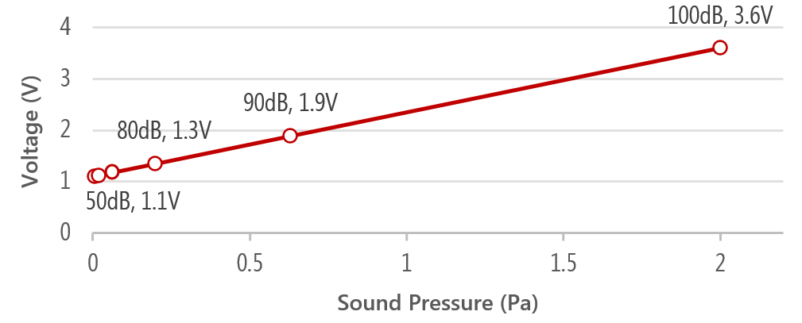

# Vibes # 

## Introduction ##
Vibes is a wrist-worn device that senses ambient sound and emits a vibration proportional to the sound level (i.e., loudness). This is a supplementary repository to our ISWC 2020 paper: "Field Study of a Tactile Sound Awareness Device for Deaf and Hard of Hearing Users".We built our own custom device because, when our research began, most commercial devices (e.g., a smartwatch) only offered a single vibration intensity level (some had two). To convey loudness, our device needed to provide varying intensity in a continuous spectrum. The wrist was selected because of high tactile perception, and the widespread use of wrist-worn devices (e.g., watches, fitness trackers). Finally, compared to other sound properties that are potentially of interest (e.g., direction, pitch), we chose loudness because it can be reliably sensed with current technology and is relatively easy to comprehend—particularly for those who are born fully deaf and may not have a perceptual basis for sound. 

[[Paper PDF](https://homes.cs.washington.edu/~djain/img/portfolio/Jain_Vibes_ISWC2020.pdf)]

While designing Vibes, we performed three major iterations (see figure below). The iterations improved the prototype hardware (e.g., adding rechargeable battery from prototype B onwards), software (e.g., adding a loudness threshold from Prototype B), and housing (e.g., a more versatile casing). The final prototype costs $45 USD in parts, takes four hours to charge, and lasts for about 24 hours of continuous use. Below, we explain our design details and the repository structure. 

## Table Of Contents ##

1. [Hardware](#hardware)
2. [Software](#software)
3. [Housing](#housing)
4. [Support](#support)

## Hardware ##

The Vibes hardware sensed the sound, processed the audio, and conveyed the vibration. For sensing sound, we used an [electret capsule microphone](https://www.adafruit.com/product/1713) which is inexpensive and much smaller in size (6mm dia) than [true condenser alternatives](https://www.neumann.com/homestudio/en/what-is-the-difference-between-electret-condenser-and-true-condenser-microphones). As the output from the microphone can be noisy, the signal was passed through a [breakout board](https://www.adafruit.com/product/1063) which included a bypass capacitor to smoothen the signal and a 25x gain op-amp for amplification. The output of the breakout board was then transmitted to an analog pin of the microcontroller for processing. 

The microcontroller triggered the vibratory motor by varying the voltage in response to the sound signal. While linear resonant motors (LRA) are commonly used in haptics research as their intensity and frequency can be independently controlled, we used an [eccentric rotating mass (ERM)](https://www.adafruit.com/product/1201) which are more common in mobile devices due to their low cost, small size, and use of direct current (DC) vs. alternating current (AC). ur ERM motor had a 100ms response time from idle state to full vibration. 

The PCB files are included in the folder `PCB`. 

## Software ##

The software, written in C for [trinket microcontroller](https://www.adafruit.com/product/1500), processed the audio signal. The built-in analog-to-digital convertor received the analog signal from the breakout board, sampled it at 32kHz, and mapped the output to the full voltage range of the vibration motor (1.1–3.6V) using a linear function of sound pressure (Pa) to voltage (V) (see figure below). We used a loudness threshold of 50dB (6.3x10-3 Pa) to filter common background noises (e.g., AC or refrigerator hum) which occur just below 50dB. To do so, we played a 50dB sound from a computer at 500Hz and used the measured microphone output as the minimum value to trigger the vibration motor. This threshold was determined during a five-week pilot with the hard of hearing team member The resultant mapping was 6.3x10-3Pa (50dB)–2.0Pa (100dB) to 1.1–3.6V.

The C code for the trinket microcontroller appears in the folder `Code`.

## Housing ##

The housing enclosed the Vibes hardware. We iteratively designed the housing using rapid prototyping techniques while referring to several online wrist-worn device designs including activity trackers, watches and bracelets. For later prototypes, we used a snap-fit joint which has advantages of speed and durability over loose fasteners. The housing for the final prototype measured 3.2cm × 2.4cm × 1.1cm, which was worn on the wrist using a Velcro strap. 

The CAD files for the housing are in the folder `CAD`.

## Support ##
Contact [Dhruv Jain](www.dhruvjain.info) through email `djain@cs.washington.edu`
Developed with collaborators at the [UW Makeability Lab](https://makeabilitylab.cs.washington.edu/) and the [MIT Media Lab's Living Mobile Group](https://www.media.mit.edu/groups/living-mobile/overview/)

Drop us a note if you are using or plan to use Vibes for research purposes. We are happy to help with any questions or issues.